# 生命周期说明

> 1.插件、路由中间件、路由校验（介于初始化插件后与执行路由中间件之间执行）在客户端、服务端都会执行，实际业务中，需通过import.meta.xxxx进行判断
> 

# Nuxt4.3 -> Nuxt 4.4的改进

链接：https://github.com/nuxt/nuxt/releases/tag/v4.4.0

1.definePageMeta指定layout模版的同时，可传递props

2.使用vue-router5版本路由，移除unplugin-vue-router依赖

3.增加createUseFetch and createUseAsyncData，增强useFetch和useAsyncData可配置性

4.文件系统路由生成迁移到了 unrouting

5.缓存路由的智能负载处理

6.useCookie增加refresh刷新属性

7.useState支持重置为默认值

8.增加构建分析

```
nuxt build --profile
```

其他试验性特性，请移步 https://github.com/nuxt/nuxt/releases/tag/v4.4.0 查看

# Nuxt 4.2 -》Nuxt 4.3的改进

## 1.setPageLayout增加了第二个参数

```javascript
export default defineNuxtRouteMiddleware((to) => {
  // 使用布局模板时，进行传递第二个参数
  setPageLayout('admin', {
    sidebar: true,
    theme: 'dark'
  })
})
// 布局模板
<script setup lang="ts">
    defineProps<{
        sidebar?: boolean
        theme?: 'light' | 'dark'
    }>()
</script>
```

## 2.增加了服务端目录别名#server

```javascript
// Before: relative path hell
import { helper } from "../../../../utils/helper";

// After: clean and predictable
import { helper } from "#server/utils/helper";
```

## 3.可拖拽错误叠加

```javascript
错误弹窗变成可拖拽;
```

## 4.增加异步插件构造器

这使得构建插件可以真正懒惰加载，避免了不需要插件时不必要的代码加载。


```javascript
export default defineNuxtModule({
  async setup() {
    // Lazy load only when actually needed
    addVitePlugin(() => import("my-cool-plugin").then((r) => r.default()));

    // No need to load webpack plugin if using Vite
    addWebpackPlugin(() =>
      import("my-cool-plugin/webpack").then((r) => r.default()),
    );
  },
});
```

## 5.添加对Webpack/RSPACK构建器的支持

## 6.错误页面返回的数据结构变更

statusCode → status \
statusMessage → statusText

## 7.新增查看当前路由所属元组的api

```javascript
<script setup lang="ts">
// This page's meta will include: { groups: ['protected'] }
useRoute().meta.groups
</script>

export default defineNuxtRouteMiddleware((to) => {
    if (to.meta.groups?.includes('protected') && !isAuthenticated()) {
        return navigateTo('/login')
    }
})
```

## 8.在某个layer中禁用某个module

```javascript
export default defineNuxtConfig({
  extends: ["../shared-layer"],
  // disable @nuxt/image from layer
  image: false,
});
```

## 9.可以直接在routeRules中，根据路由规则进行指定布局

方便的管理符合同一路由规则的路由应用同一个布局文件\

```javascript
export default defineNuxtConfig({
  routeRules: {
    "/admin/**": { appLayout: "admin" },
    "/dashboard/**": { appLayout: "dashboard" },
    "/auth/**": { appLayout: "minimal" },
  },
});
```

# 性能

> 1.能使用composables就别使用plugin，因为plugin在水合阶段执行的（会阻塞服务端页面渲染），而composables在组件初始化阶段执行的 \
> 2.合理使用plugin的并行异步加载（parallel: true），可以并行加载多个plugin，提高页面加载速度 \
> 3.有链接跳转或路由跳转时，建议使用NuxtLink标签替代Router、<a />,因为其可以设置预加载时机、预取等属性，提高用户体验 \
> 4.合理利用混合渲染 \
> 5.利用延迟加载组件、组件惰性水合提高服务端水合效率 \
> 6.使用useFetch、useAsyncData确保在服务器端、客户端都执行的环境下，只在服务端请求一次api（后端仅收到一次请求） \
> 7.使用NuxtImg标签替代img标签，因为其可以自动进行分辨率转换，提高页面加载速度、清晰度 \
> 8.使用NuxtLayout标签替代Layout标签，因为其可以设置布局切换动画，提高用户体验 \
> 9.移除无用依赖，因为它将增加项目的捆绑包大小 \
> 10.vue相关的性能，使用shallowRef、v-memo、v-once进行性能优化

```javascript
<template>
  <!-- 🚨 Needs to be loaded ASAP -->
  <NuxtImg
    src="/hero-banner.jpg"
    format="webp"
    preload
    loading="eager"
    fetch-priority="high"
    width="200"
    height="100"
  />

  <!-- 🐌 Can be loaded later -->
  <NuxtImg
    src="/facebook-logo.jpg"
    format="webp"
    loading="lazy"
    fetch-priority="low"
    width="200"
    height="100"
  />
</template>

```

# 项目版本升级

```javascript
// 执行此命令前，记得先pnpm i安装依赖，否则可能会一直卡进度
npx nuxt upgrade --dedupe
```

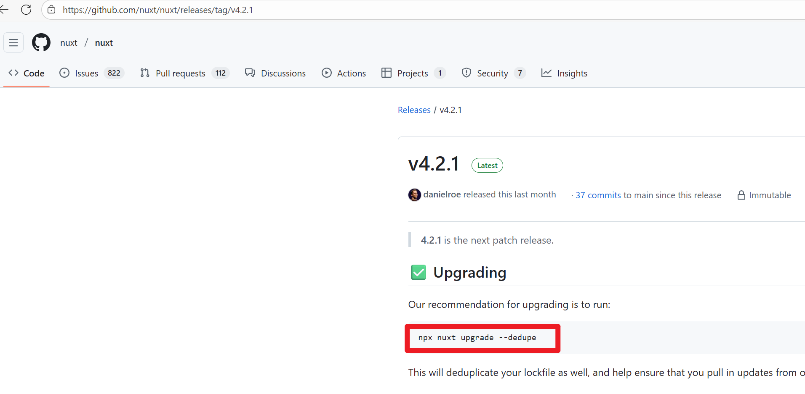

# 混合渲染

官方链接：https://nuxt.com/docs/4.x/guide/best-practices/performance#hybrid-rendering

# 加载进度条/loading显示 (推荐)

## 在 app.vue 或 app/layouts/ 使用<NuxtLoadingIndicator/>

```javascript
<template>
  <div>
<!--通过指定布局name，覆盖默认的default布局-->
<!--<NuxtLayout name="layout-one">-->
<!--<NuxtPage />-->
<!--</NuxtLayout>-->
    <!-- 推荐使用NuxtLoadingIndicator组件+useLoadingIndicator -->
    <NuxtLoadingIndicator />
<!--Loading组件导致控制台会有告警不用理会，生产不会有，也不影响功能正常使用,但是SEO会受影响,因为是在客户端生命周期关闭的(不建议使用此方式，不需要可自行删掉)-->
<!--    <Loading :loading="loading" :enableLoading="enableLoading">-->
      <NuxtLayout>
        <NuxtPage />
      </NuxtLayout>
<!--    </Loading>-->
  </div>
</template>
<script setup lang="ts">
// import { useLoadingStore } from '~/store/loading.js'
// import { storeToRefs } from 'pinia'
// const { loading,enableLoading } = storeToRefs(useLoadingStore())
</script>
```

## 在请求时使用useLoadingIndicator

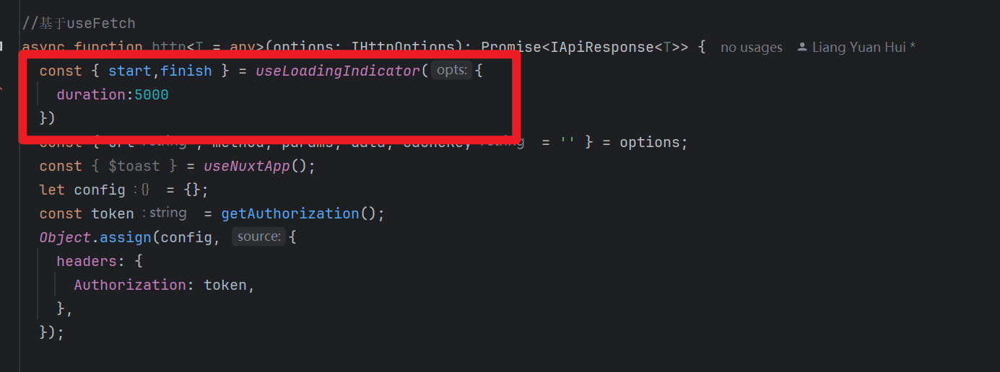
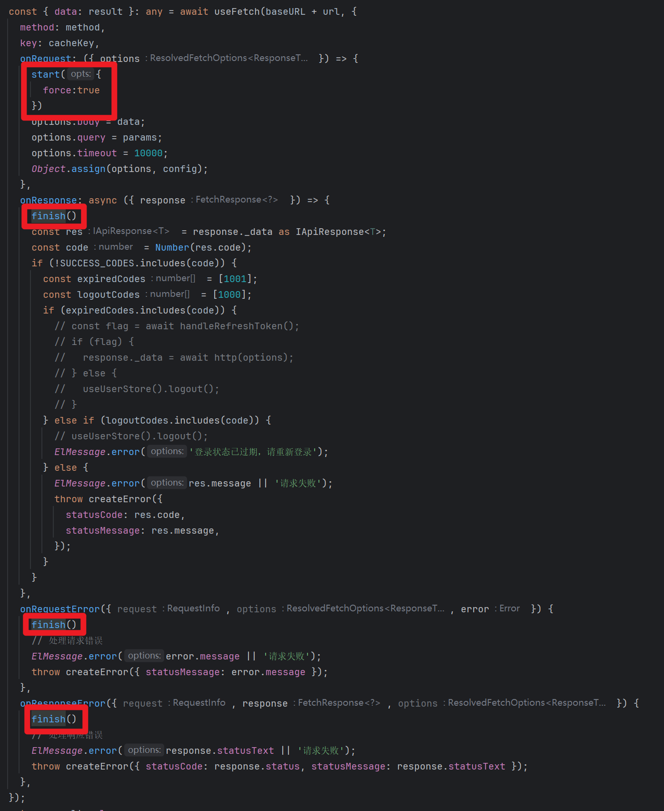

```javascript
import { useLoadingIndicator } from "nuxt/app";
const { enableLoading, disableLoading } = useLoadingIndicator();
```

## 调整z-index

```javascript
.nuxt-loading-indicator{
  z-index: 9999999999 !important;
}
```

# ISR增量渲染

## 最好isr、swr（必须要配置，否则缓存不生效）一起配置，单位为秒


## 页面请求测试


会发现，在60s缓存期间，前端一直请求，是不会请求后端接口的

# 整合AOS动画库

## 参考博文

链接:https://blog.csdn.net/gitblog_01118/article/details/154934278

## 安装依赖

```javascript
pnpm install aos
```

## 编写插件aos插件

app/plugins/aos.client.ts

### 方式一

```javascript
import AOS from "aos";
export default defineNuxtPlugin(() => {
  /**
   * 方式一，每次都需要在需要使用的界面，进行以下初始化，麻烦
   */
  return {
    provide: {
      aos: () => AOS,
    },
  };
});
```

#### 在需要的页面进行初始化

```javascript
import { useNuxtApp } from "nuxt/app";
const { $aos } = useNuxtApp();
onMounted(() => {
  $aos().init({
    easing: "ease-out-back",
    duration: 1000,
  });
});
```

### 方式二

```javascript
import AOS from "aos";
export default defineNuxtPlugin(() => {
  AOS.init({
    easing: "ease-out-back",
    duration: 1000,
  });
});
```

#### 直接在页面使用data-aos属性即可


## 动画类型说明

```javascript
淡入淡出类：fade、fade-up、fade-down、fade-left、fade-right等
翻转类：flip-up、flip-down、flip-left、flip-right
滑动类：slide-up、slide-down、slide-left、slide-right
缩放类：zoom-in、zoom-in-up、zoom-in-down、zoom-out等
```

## 注意事项

### 1.开发环境可能出现以下警告，功能正常，可以不用理会，也不影响正常打包，正常环境不会有警告

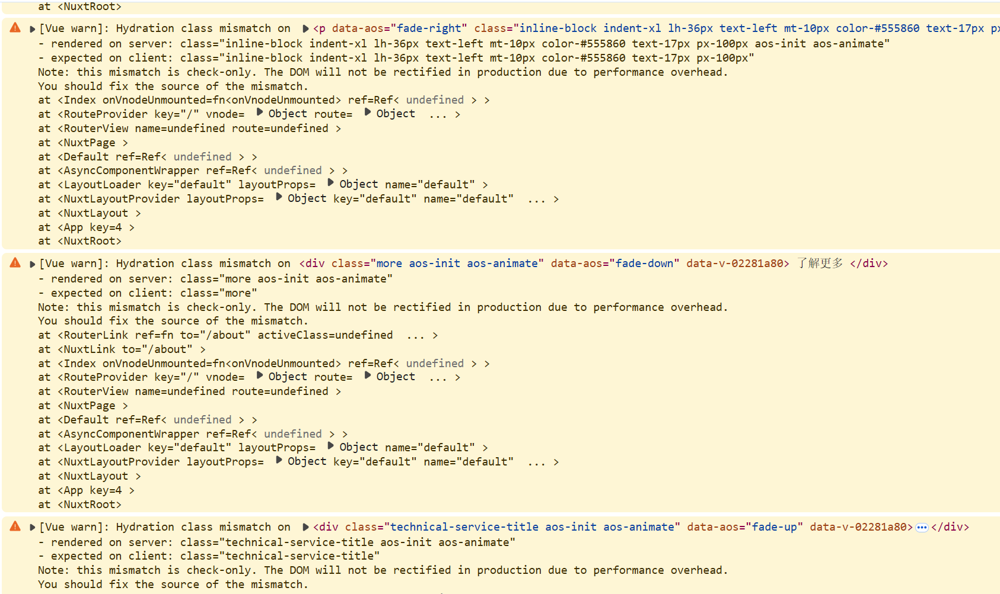

# 执行时机注意事项

> 1.在 script setup 中的代码，会在client、server都执行一次\
> 2.client、server都执行的情况下，要操作localStorage时，使用useCookie\
> 3.避免在SSR期间使用仅客户端条件

```javascript
// 错误做法
<template>
  <div v-if="window?.innerWidth > 768">
    Desktop content
  </div>
</template>
//正确做法，使用媒体查询
<template>
    <div class="responsive-content">
        <div class="hidden md:block">Desktop content</div>
        <div class="md:hidden">Mobile content</div>
    </div>
</template>
```

> 4.对于有副作用的第三方库，要在客户端初始化完成时才引入，避免在服务端执行时引入，因为服务端没有window对象或DOM为加载完全的情况

```javascript
// 问题：修改 DOM 或具有浏览器依赖项的库（标签管理器经常发生这种情况）。
<script setup>
    if (import.meta.client) {
        const { default: SomeBrowserLibrary } = await import('browser-only-lib')
        SomeBrowserLibrary.init()
    }
</script>
// 解决方案：在水合完成后且浏览器端DOM初始化完成：
<script setup>
    onMounted(async () => {
        const { default: SomeBrowserLibrary } = await import('browser-only-lib')
        SomeBrowserLibrary.init()
    })
</script>
```

> 5.由于服务器端和客户端数据不一致的情况（针对客户端，服务端都执行的环境下，仅以最先执行的结果为准，不会重复进行执行）

```javascript
<template>
    <div>{{ state }}</div>
</template>
//使用useState进行处理，确保在客户端和服务端都有相同的随机数
<script setup>
    const state = useState('random', () => Math.random())
</script>

```

# 客户端、服务端判断条件

```javascript
if (import.meta.server) {
  console.log("server");
}
if (import.meta.client) {
  console.log("client");
}
```

# 生产环境、开发环境判断

```javascript
if(process.env.NODE_ENV !== 'development'){
    ...
}
```

# 整合i18n多语言

@nuxtjs/i18n默认是基于路由+cookie的，例如：/hello，/vn/hello，/en/hello

## 安装依赖

```javascript
pnpm i @nuxtjs/i18n
```

## 配置nuxt.config.ts

```javascript
...
modules: [
    ...
    '@nuxtjs/i18n',
],
i18n:{
    defaultLocale: 'cn',
        baseUrl: 'http://airsat.aseann.net',
        locales: [
        {
            code: 'cn',
            name: '中文',
            file: 'cn.json',
            language:'zh-CN'
        },
        {
            code: 'vn',
            name: '越南语',
            file: 'vn.json',
            language:'vi-VN'
        },
        {
            code: 'en',
            name: 'EN',
            file: 'en.json',
            language: 'en-US'
        }
    ],
},
...
```

## 创建多语言文件

与app目录同级，创建i18n目录，在i18n目录下创建locales目录，在locales目录下创建cn.json、vn.json、en.json文件


```javascript
// cn.json
{
    "hello": "你好"
}
// vn.json
{
    "hello": "Xin chào"
}
// en.json
{
    "hello": "Hello"
}
```

## 在页面进行使用

### 在页面通过$t进行使用

```javascript
<template>
    <div>{{ $t('hello') }}</div>
</template>
```

### useI18n的使用

```javascript
<template>
    <div>{{ $t('hello') }}</div>
    <div class="content-right">
        <div class="lang-box">
            <span :class="{active : item.code == locale}" v-for="item in locales" @click="changeLang">{{ item.name }}</span>
        </div>
    </div>
</template>
<script setup lang="ts">
const { locales, locale, setLocale,t } = useI18n()
// 切换语言示例
function changeLang(){
    if(locale.value !='en'){
        setLocale('en')
    }else{
        setLocale('cn')
    }
}
</script>
```

### 把正常路径转换为多语言路径

#### 代码操作(useLocalePath)

```javascript
<template>
    <div>{{ $t('hello') }}</div>
</template>
<script setup lang="ts">
const localePath = useLocalePath()
function clickDemo(child:any){
    navigateTo(localePath(`/informationDetail/${child.id}`), {
        open: {
            target: '_blank',
        },
    })
}
</script>
```

#### 页面操作($localePath)

```javascript
<NuxtLink class="li-item" :to="$localePath(item.path)" v-for="item in navs" :key="item.id">
  {{ locale!='cn' ? item.enTitle : item.title}}
</NuxtLink>
```

## 注意事项

### 1.如果是默认语言路由路径的话，不能在浏览器进行直接输入，否则会报404错误

比如默认语言是cn，那么默认路由路径就是/hello，不能在浏览器直接输入/cn/hello，否则会报404错误

# 中间件

## 中间件分类

### 全局中间件(以.global结尾)

例如：analytics.global.ts

### 命名中间件

例如：auth.ts

### 内联中间件

```javascript
<script setup lang="ts">
definePageMeta({
  middleware: [
    function (to, from) {
      // Custom inline middleware
    },
    'auth',
  ],
});
</script>

```

## 在plugin为Page动态设置中间件

```javascript
import type { NuxtPage } from 'nuxt/schema'

export default defineNuxtConfig({
  hooks: {
    'pages:extend' (pages) {
      function setMiddleware (pages: NuxtPage[]) {
        for (const page of pages) {
          if (/* some condition */ true) {
            page.meta ||= {}
            // Note that this will override any middleware set in `definePageMeta` in the page
            page.meta.middleware = ['named']
          }
          if (page.children) {
            setMiddleware(page.children)
          }
        }
      }
      setMiddleware(pages)
    }
  }
})

```

## 动态创建中间件

```javascript
export default defineNuxtPlugin(() => {
  addRouteMiddleware(
    "global-test",
    () => {
      console.log("这个全局中间件是在插件中添加的，将在每次路由更改时运行");
    },
    { global: true },
  );

  addRouteMiddleware("named-test", () => {
    console.log("这个命名的中间件被添加到插件中，并将覆盖任何同名的现有中间件");
  });
});
```

## 路由中间件的返回值说明

> 1.直接return，相当于当前中间件不处理，继续执行下一个中间件，如果没有下一个，则放开导航\
> 2.return navigateTo('/') 重定向到给定的路径，并将重定向代码设置为302（如果重定向发生在服务器端）\
> 3.return navigateTo('/home', { statusCode: 301 }) 重定向到给定的路径，并将重定向代码设置为301\
> 4.return abortNavigation()- 停止当前导航（没有任何反应）\
> 5.return abortNavigation(new Error('Custom error'))- 拒绝当前导航并出现自定义错误

## 执行顺序

全局中间件（有多个全局则按照字母顺序）》页面中间件（如果有多个则按照数组顺序）

# 开发环境Node版本

## node 22.18.0（最好是偶数版本）

# nuxt generate命令说明

## ssr设置为true

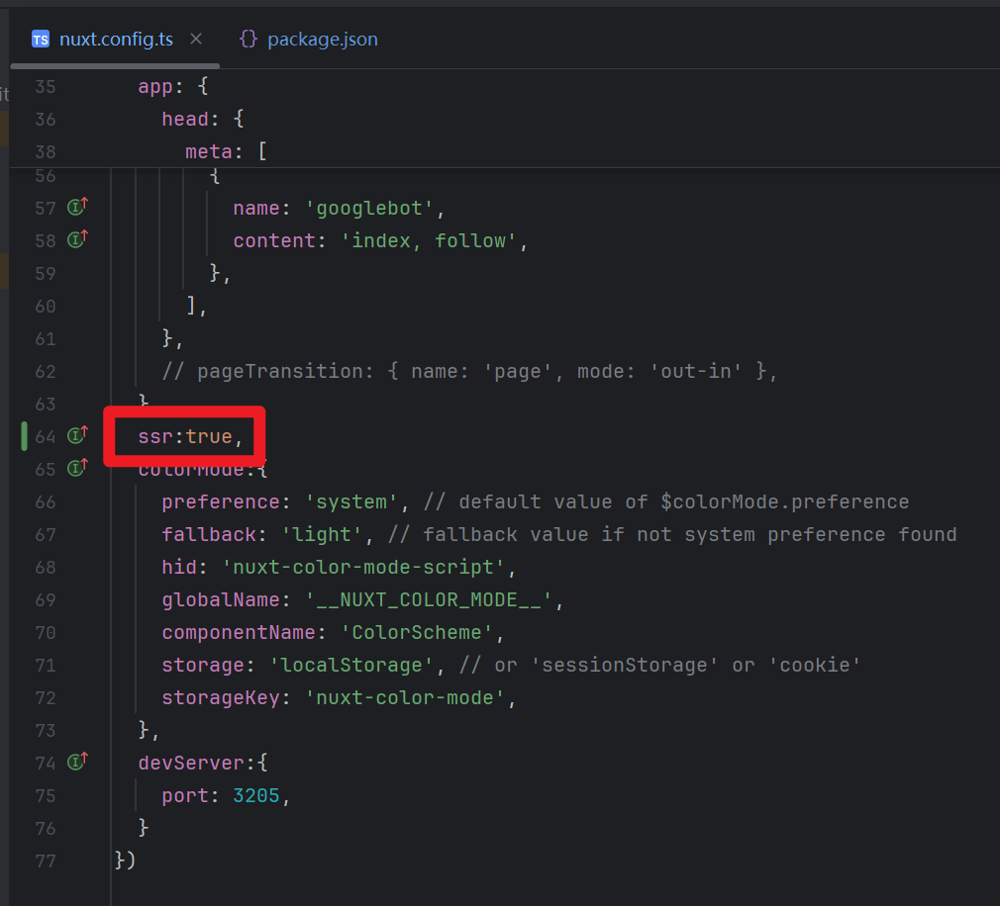
执行nuxt generate命令打包时，会请求后端接口生成静态html页面，具有SEO功能（只是打包此刻所获取的信息）
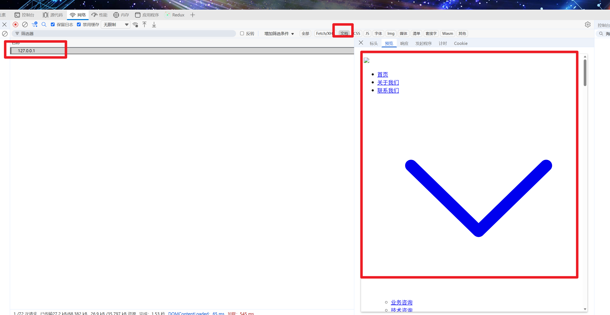
首次请求，返回的文档信息就是打包时获取的信息（不会实时更新，要更新需要重新打包）
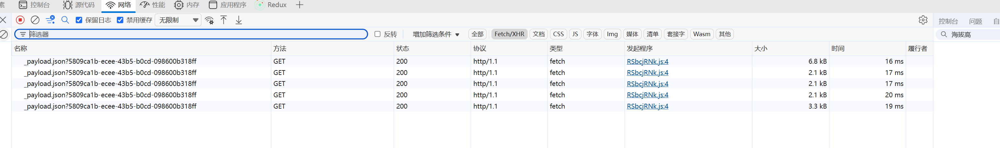
可以看到，首次打开页面，都是获取的打包时请求后端接口获取到的静态内容，不会进行请求后端接口

## ssr设置为false

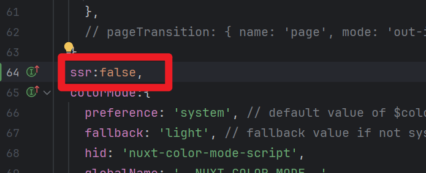
执行nuxt generate命令打包时，不会请求后端接口，跟平时我们用vue写的单页面应用一模一样
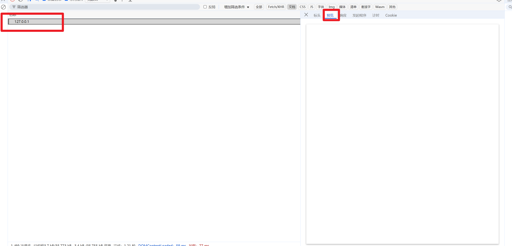
可以看到返回的文档都是空白的，而且首次打开页面，会直接实时请求后端接口
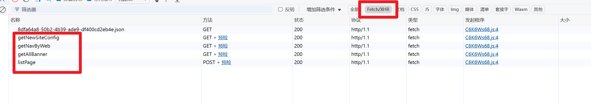

# 什么是水合

```javascript

<template>
 <div>
  <h1>{{ title }}</h1>
  <button @click="count++">点击次数: {{ count }}</button>
 </div>
</template>

<script setup>
 const title = '水合示例'
 const count = ref(0)
</script>

```

```javascript
服务端会生成
<h1>水合示例</h1>
<button>点击次数: 0</button>
这个HTML并返回给客户端，而在客户端中vue会找到这个按钮并添加点击事件监听器。
```

# 远端数据请求方式

## 做法1.使用useFetch

```javascript
//useFetch的效果相当于useAsyncData+$fetch
const { data } = await useFetch("/api/item");
```

## 做法2.使用useAsyncData+$fetch

```javascript
//在SSR期间，数据仅在服务器端获取并传输到客户端,也就是说不会造成重复请求
const { data } = await useAsyncData("item", () => $fetch("/api/item"));
```

## 做法3.单独使用$fetch

```javascript
//在SSR过程中，数据会被提取两次(后端接口会被调用两次，除非只在client生命周期使用)，一次在服务器上，另一次在客户端上。
const dataTwice = await $fetch("/api/item");
```

# 最佳实践

## sitemap站点地图的应用

### 为什么要做站点地图

#### 提升用户体验

对于一些中大型网站，网站的目录、频道页面很多，用户一下找不到自己想要的页面，此时如果网站做了网站地图，用户通过网站地图可在短时间内找到自己想要的页面，当然网站地图要做的合理，这需要前期的细致规划。

#### 提升蜘蛛的抓取效率、收录

提升蜘蛛的抓取效率，从而促进网站收录。网站地图将网站所有的有效页面都放在了一起，可以让蜘蛛短时间内发现网站所有的链接，从而爬取收录。

### 关于网站地图格式说明

谷歌、百度：需要.xml格式 \
雅虎：.txt格式

### 如何提交 SiteMap 给搜索引擎

参考链接：https://help.metinfo.cn/faq/398.html

### 安装依赖模块

```javascript
npx nuxt module add @nuxtjs/sitemap
```

安装完模块，会自动添加到nuxt.config.ts配置


### 在nuxt.config.ts进行配置

```javascript
...
site:{
    url: 'https://example.com',
    name: 'My Awesome Website'
}
...
```

### 执行打包测试

```javascript
npm run build
```

### 访问测试

```javascript
访问http://127.0.0.1:3000/sitemap.xml
```


> 可以看到站点地图列出来的地址取的是i18n设置的baseUrl，所以我们最好把site.url与i18n.baseUrl设置为一致的

## SEO、元数据、视口设置

官网案例：https://nuxtjs.org.cn/docs/4.x/getting-started/seo-meta

# 关于.env多环境配置说明

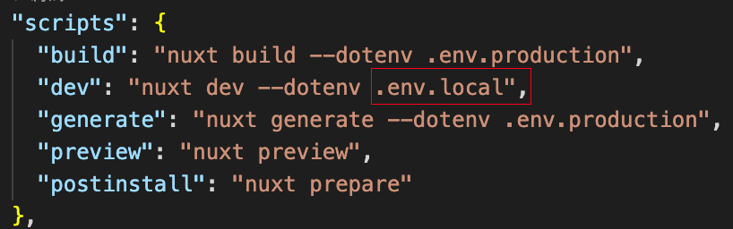
在开发环境，执行nuxt dev --dotenv 指定配置文件时会报错，此时可以在开发环境不指定配置文件，默认使用.env环境配置文件
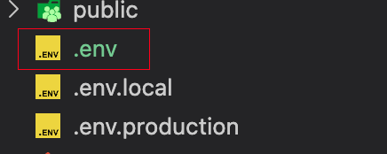

再次执行pnpm dev即可

# Nuxt Minimal Starter

Look at the [Nuxt documentation](https://nuxt.com/docs/getting-started/introduction) to learn more.

## Setup

Make sure to install dependencies:

```bash
# npm
npm install

# pnpm
pnpm install

# yarn
yarn install

# bun
bun install
```

## Development Server

Start the development server on `http://localhost:3000`:

```bash
# npm
npm run dev

# pnpm
pnpm dev

# yarn
yarn dev

# bun
bun run dev
```

## Production

Build the application for production:

```bash
# npm
npm run build

# pnpm
pnpm build

# yarn
yarn build

# bun
bun run build
```

# 预览生成的静态站点（pnpm generate）

```bash
# npm
npm run preview

# pnpm
pnpm preview

# yarn
yarn preview

# bun
bun run preview
```

Check out the [deployment documentation](https://nuxt.com/docs/getting-started/deployment) for more information.
